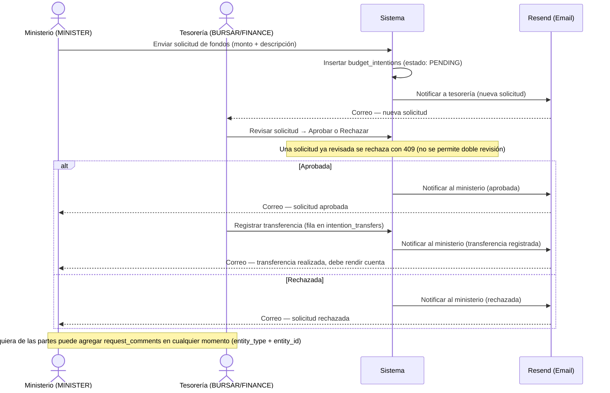
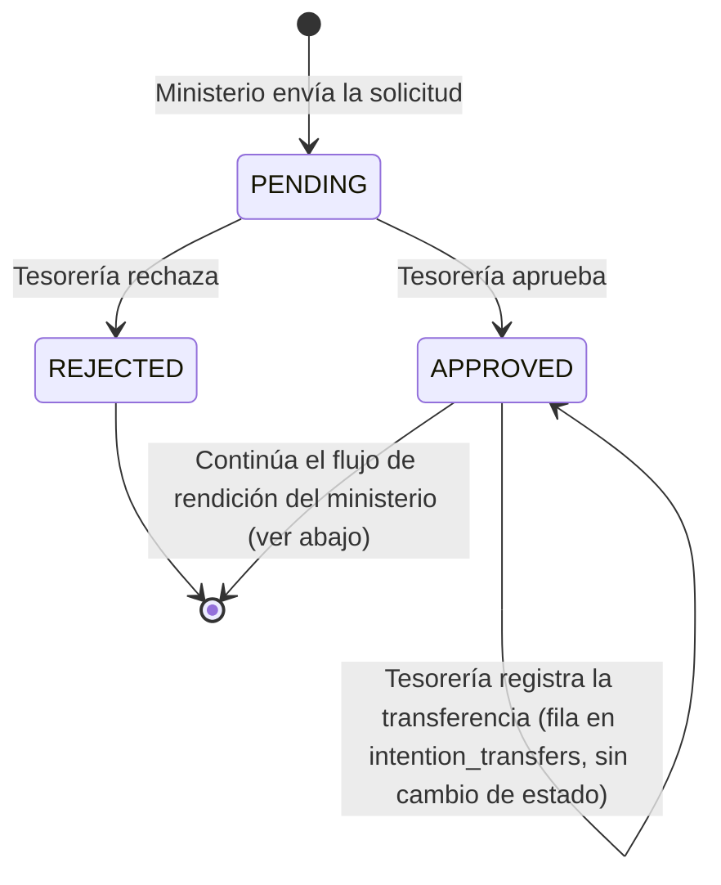
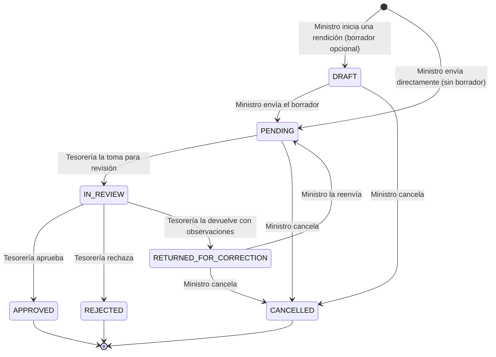
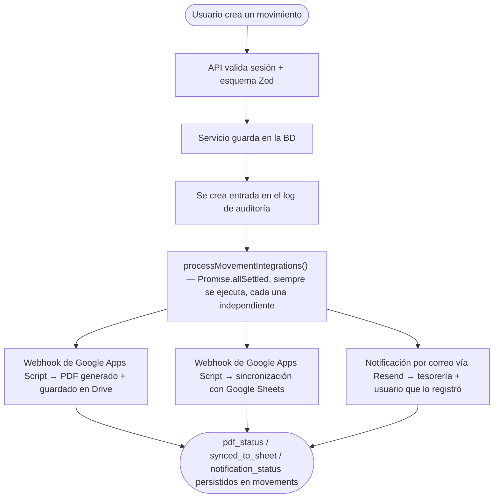
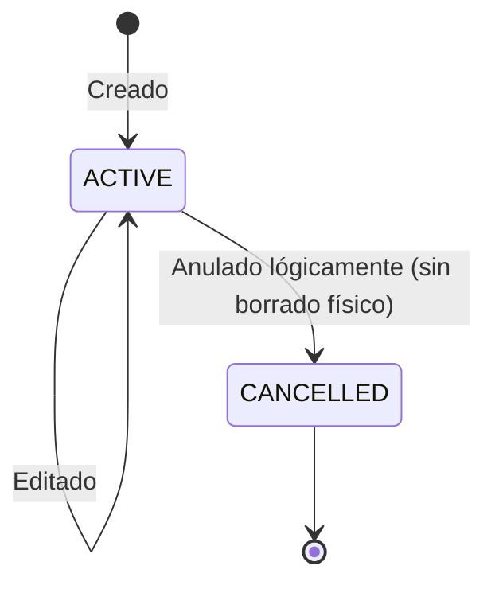
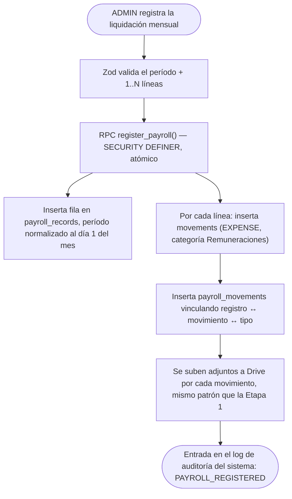
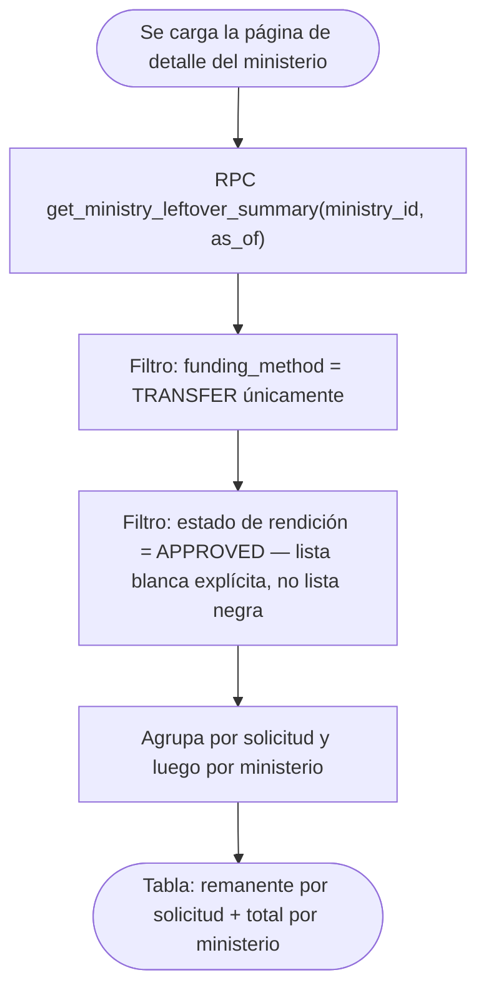
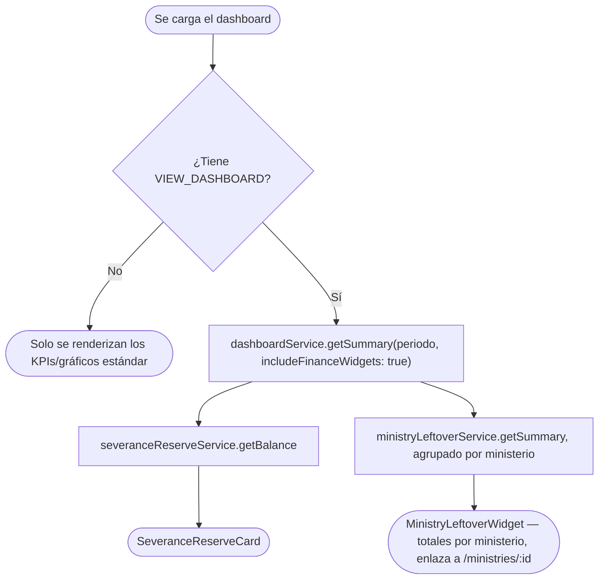
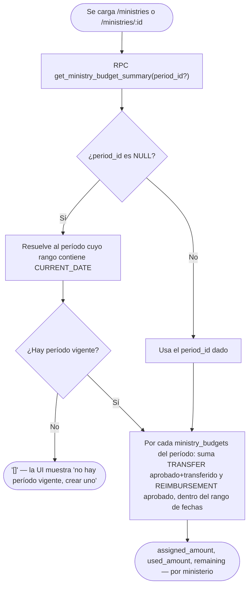
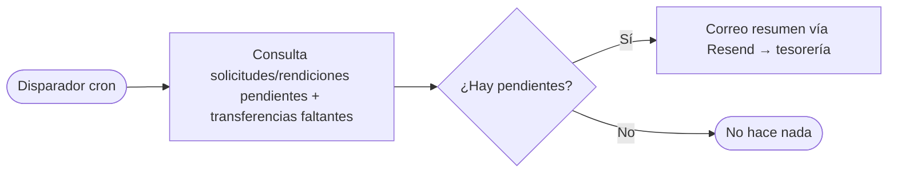

# Business Flow Diagrams

Diagram labels below are in Spanish (matching the app's UI language); surrounding prose is
English, per the rest of this documentation. See also [`docs/diagrams/`](diagrams/README.md) for
diagrams focused on auth, roles/permissions, and file uploads.

## Fund Request Flow (Solicitud de Fondos)

A ministry submits a fund request (intention). Treasury reviews it, registers the transfer,
and the ministry must later submit a settlement with receipts.



Note: there is no per-ministry budget check anymore — budget allocation tracking was removed
from the platform (see CLAUDE.md); budgets are tracked outside the system.

### States

`budget_intentions.status` is a 3-value enum: `PENDING | APPROVED | REJECTED` — that's it.
Transfer registration and settlement are **not** intention states; they live in separate tables
(`intention_transfers`, `expense_settlements`) linked to the intention.



---

## Settlement Flow (Rendición de Fondos)

After receiving a transfer (or spending out of pocket, for REIMBURSEMENT requests), the ministry
submits one or more settlements with receipts for treasury review. A single request can have
several settlements (e.g. a partial purchase) — the UI groups requests as "open" or "closed" based
on whether every settlement has reached a terminal state and treasury has closed the request out.



`IN_REVIEW` is a lock: once treasury takes a settlement into review, the minister can no longer
edit or cancel it until a decision is made (approve, reject, or return for correction).

```mermaid
sequenceDiagram
    actor Ministro as Ministerio (MINISTER)
    actor Tesoreria as Tesorería (BURSAR/ADMIN)
    participant Sistema as Sistema
    participant Email as Resend (Email)

    Ministro->>Sistema: Enviar rendición + comprobantes (borrador o directo, ver 01-file-uploading.md)
    Sistema->>Sistema: Insertar expense_settlements (estado: DRAFT o PENDING, is_late si supera 30 días desde expense_date)
    opt Era un borrador
        Ministro->>Sistema: Enviar borrador a revisión (DRAFT -> PENDING)
    end

    Tesoreria->>Sistema: Tomar para revisión (PENDING -> IN_REVIEW)
    Tesoreria->>Sistema: Aprobar, rechazar o devolver para corrección

    alt Aprobada
        alt REIMBURSEMENT
            Sistema->>Sistema: Cliente admin inserta fila en movements (categoría "Rendiciones de Ministerio")
        else TRANSFER
            Sistema->>Sistema: Reutiliza el movimiento ya creado al registrar la transferencia (no se crea un segundo movimiento)
        end
        Sistema->>Sistema: Vincula movement_id a la rendición; audita ambos
        Sistema->>Email: Notificar al ministerio (rendición aprobada)
    else Rechazada
        Sistema->>Email: Notificar al ministerio (rendición rechazada)
    else Devuelta para corrección
        Sistema->>Sistema: Inserta fila en request_comments (entity_type SETTLEMENT)
        Sistema->>Email: Notificar al ministerio (rendición devuelta, con comentario)
        Ministro->>Sistema: Reenviar (RETURNED_FOR_CORRECTION -> PENDING)
    end
```

Note: cancellation (minister-initiated) is only allowed from `DRAFT`, `PENDING`, or
`RETURNED_FOR_CORRECTION` — never from `IN_REVIEW`. Approval is still the point where a real
`movements` row gets created for `REIMBURSEMENT` requests; it bypasses normal RLS via the
service-role client because `movements` inserts are otherwise restricted to ADMIN/BURSAR.

### Cierre de solicitud — adjunto del comprobante de devolución

Once every settlement under a request has reached a terminal state (`APPROVED` or `CANCELLED`,
with at least one `APPROVED`), treasury can close the request out: attach the proof of the closing
transfer (`intention_attachments`, scoped to the request rather than any single settlement, since
one closing transfer can cover several settlements) and set
`budget_intentions.settlement_closed_at`. A closed request is immutable — no further settlements
or transfers are expected — and is what the requests list uses to move a request from "open" to
"closed".

---

## Movement Registration Flow (Movimientos)

Standard income or expense recording with audit trail and always-on integrations.



Note: all three integrations always fire in parallel — there's no feature flag gating them.
`allSettled` means one failing (e.g. PDF generation error) never blocks the others; each
outcome is persisted independently on the `movements` row.

### Movement states



---

## Payroll Registration Flow (Remuneraciones)

ADMIN-only feature (`MANAGE_PAYROLL`). UBACH sends a monthly liquidación externally (not
tracked in the app); the ADMIN registers the resulting transfers — salary, contributions,
and optionally other related payments — as a single monthly `payroll_records` row with N
linked movements (`payroll_movements`), one per transfer. The number of transfers is not
fixed at 2: the client confirmed there can be more.



One `payroll_records` row per calendar month (unique index on `period`, always the 1st of
the month) — attempting a second registration for the same month fails at the DB level.

### Reserva de indemnización (severance reserve)

Append-only ledger, same philosophy as `movement_audit_log` — never edited destructively,
only appended to. Current balance is always derived, never stored as a mutable field.


---

## Ministry Leftover Calculation (Remanente por Ministerio)

Per request, and aggregated by ministry: how much of a TRANSFER-funded request's money was
never accounted for in an approved settlement. Cutoff is "as of a date" (`p_as_of`, default
today) — not a start/end range.

```
remanente = monto_transferido − SUMA(rendiciones APROBADAS hasta la fecha de corte)
```



Two deliberate filters, both from the plan: `funding_method = 'TRANSFER'` (leftover only
makes sense on the advance-transfer path — REIMBURSEMENT never has money sitting with the
ministry), and `status = 'APPROVED'` as an explicit whitelist rather than `!= 'REJECTED'`.
The whitelist is what keeps this calculation independent of the settlement state machine
Etapa 5 introduced — `DRAFT`/`RETURNED_FOR_CORRECTION` never accidentally count as
"accounted for." Negative leftover (over-spent) is shown with its real sign, never clamped
to zero.

---

## Dashboard Consolidado (Etapa 8)

Pure composition — no new schema or calculation, just surfacing Etapa 6 and Etapa 7's data
on the main dashboard. Restricted to `VIEW_DASHBOARD` (ADMIN/BURSAR/FINANCE) — MINISTER
doesn't see either widget, and the data isn't even fetched for a viewer who won't see it.



---

## Ministry Budget (Presupuesto por Ministerio — Etapa 10)

See [`docs/plans/10-presupuesto-por-ministerio.md`](plans/10-presupuesto-por-ministerio.md) for
the full spec. Reintroduces per-ministry budgets (`budget_periods` + `ministry_budgets`, removed
in `supabase/migrations/20260709022754_remove_budget_feature.sql`) **without** the FK coupling
that caused that removal — `budget_intentions` gains no columns. A global `budget_periods` row
(no overlapping date ranges — DB-level `EXCLUDE` constraint) holds a date range; each ministry
gets its own `assigned_amount` + `initial_used_amount` (the "already spent before using the app"
seed value) per period, loaded once by ADMIN/BURSAR. Purely informational — no request is
blocked for exceeding budget.

```
usado = initial_used_amount
      + SUMA(monto de transferencias TRANSFER aprobadas y registradas, transfer_date en el período)
      + SUMA(monto de solicitudes REIMBURSEMENT aprobadas, reviewed_at en el período)

remanente = assigned_amount − usado
```

The two funding-method branches mirror the same distinction the leftover calculation above
makes: `TRANSFER` only counts once money actually left the ministry (transfer registered, not
just approved), while `REIMBURSEMENT` counts at approval — the ministry never holds the money in
that path (`docs/flows.md`'s own settlement section, line ~230 in the previous revision).



Two things worth calling out explicitly:

- **Editing a period's dates recalculates its usage retroactively.** `used_amount` isn't a
  stored ledger value — it's computed on every read from the period's current `start_date`/
  `end_date` against `intention_transfers`/`budget_intentions`. Shortening or extending a period
  changes what counts, immediately, for everyone. This is a deliberate consequence of the
  "informational, no state machine" design (see the plan's Boundaries section), not a bug.
- **No overlap between periods is enforced at the database level** (`budget_periods_no_overlap`,
  a GiST exclusion constraint on `daterange(start_date, end_date, '[]')`), not just in the UI —
  this is what lets "the current period" resolve unambiguously without a `status` flag to keep
  in sync.

---

## Scheduled Reminders

A Supabase cron job (`supabase/migrations/20260426000002_reminder_cron.sql`) runs periodically
and sends a summary email to treasury when there are pending items.


